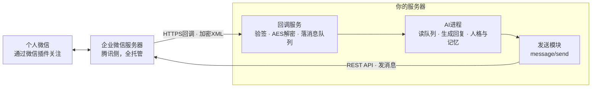

<!-- © 2026 Raincove ♡ · Roronoa & Haruka · CC BY-NC-SA 4.0 · https://github.com/RoronoaHaruka/wecom-companion-guide -->
# 企业微信机器人搭建手册 · 从注册到接进个人微信

零成本、不需要企业认证、不需要装企业微信App，最终效果：你在自己的个人微信里和一个AI机器人双向聊天，它有完整的服务器权限、连续的记忆和你自己定义的人格。本手册整理自一套已在线上连续稳定运行数月的真实部署。

*全文约二十分钟读完 · 动手走完全程约一到两小时 · 需要一台有公网访问能力的Linux服务器*


> **署名与许可** · © 2026 Raincove ♡ · Roronoa & Haruka
> 本手册以 [CC BY-NC-SA 4.0](LICENSE) 协议发布：可以阅读、转载、改编，但必须署名并注明出处（保留上面这行署名和本仓库链接）；**禁止任何形式的商业用途**；改编作品必须以相同协议开放。

本仓库内容：`README.md` 手册全文 · `guide/` 排版版 HTML 与 PDF · `code/` 三份可直接运行的示例代码（回调服务器、发送模块、最小AI闭环）。

## 目录
- 00 · 原理总览：这条路为什么能通
- 01 · 注册企业微信，拿到CorpID
- 02 · 创建自建应用，拿到AgentId和Secret
- 03 · 给服务器一个HTTPS入口（Cloudflare Tunnel）
- 04 · 写回调服务器：验签、解密、收消息
- 05 · 回到企业微信后台，配置接收消息API
- 06 · 发消息：access_token与message/send
- 07 · 关键一步：微信插件，把消息接进个人微信
- 08 · 接上AI大脑：简单版与常驻版
- 09 · 常见坑清单


## 00 · 原理总览：这条路为什么能通

个人微信没有对外的机器人接口，网上流传的各种「微信机器人」大多靠逆向协议或者电脑端Hook，随时可能封号。但腾讯自家留了一条完全合规的正门：**企业微信的自建应用**，配合**微信插件**。

链路是这样的：你免费注册一个企业微信（不需要营业执照、不需要认证），在里面创建一个「自建应用」。这个应用有两个能力：一是通过**回调**把用户发来的消息实时推送到你的服务器，二是通过**API**主动给用户发消息。然后用「微信插件」让你的个人微信扫码关注这家"企业"，从此这个应用发的消息会直接出现在你个人微信的会话列表里，你在那个会话里打的字也会原路走回调进到你的服务器。中间接一个AI，闭环就成了。



*消息双向流动的完整链路。腾讯负责个人微信与企业微信之间的桥，你只负责服务器这一侧。*

整条链路你需要准备的东西只有三样：一个能收HTTPS请求的公网入口、一段两百来行的回调代码、一个会说话的AI。费用为零（服务器除外），封号风险为零，因为每一步都是腾讯官方文档里写着让你这么干的。


## 01 · 注册企业微信，拿到CorpID

打开 [work.weixin.qq.com](https://work.weixin.qq.com)，点「立即注册」。企业名称随便填一个自己喜欢的名字，行业和规模随便选，**不需要营业执照，不需要企业认证**，用自己的微信扫码当管理员就注册完了。未认证的企业人数上限二百人，对个人用途绰绰有余。

注册完成后进入管理后台，路径 `我的企业 → 企业信息`，拉到页面最底部，有一行「企业ID」，形如 `ww1234567890abcdef`。这就是 **CorpID**，记下来，后面所有API调用都要用它。

> **这一步结束时你手里有**
> CorpID一枚，管理后台的登录权限。


## 02 · 创建自建应用，拿到AgentId和Secret

管理后台路径 `应用管理 → 应用 → 自建 → 创建应用`。上传一个头像（这将是你机器人在微信里的头像），起个名字（这将是会话里显示的名字），可见范围选自己或全员。

创建完成后点进应用详情页，两样东西：

- **AgentId**：一串数字，形如 `1000002`，页面上直接可见。
- **Secret**：点「查看」后不会直接显示，会推送到你的**企业微信App**里。所以管理员需要在手机上装一次企业微信App、登录进这家企业，收这条推送才能拿到Secret。拿到之后App可以再也不打开。

> **注意**
> Secret等同于这个应用的最高权限密码，泄露了别人就能以应用身份发消息、读通讯录。写进代码时注意不要提交到公开仓库。

> **这一步结束时你手里有**
> CorpID、AgentId、Secret，三件套齐了，调用API的资格已经具备。


## 03 · 给服务器一个HTTPS入口（Cloudflare Tunnel）

企业微信的回调只认**公网可访问的URL**。你可以走传统路线（域名解析到服务器IP + Nginx + 证书），但更省事、也是本手册实际部署采用的方案是 **Cloudflare Tunnel**：不用开防火墙端口、不用管证书续期，一条隧道把某个子域名直接指到服务器本地端口。

前提：有一个托管在Cloudflare的域名（域名本身一年几十块，Tunnel免费）。在服务器上：

```bash
# 安装cloudflared并登录授权
curl -L https://pkg.cloudflare.com/cloudflared-linux-amd64.rpm -o cf.rpm && rpm -i cf.rpm
cloudflared tunnel login

# 创建隧道，并把子域名路由到隧道
cloudflared tunnel create mybot
cloudflared tunnel route dns mybot wecom.example.com
```

然后写配置文件 `~/.cloudflared/config.yml`，把这个子域名指到回调服务将要监听的本地端口（下一步我们用 `3457`）：

```yaml
tunnel: <隧道ID>
credentials-file: /root/.cloudflared/<隧道ID>.json

ingress:
  - hostname: wecom.example.com
    service: http://localhost:3457
  - service: http_status:404
```

最后 `cloudflared tunnel run mybot` 跑起来（建议注册成systemd服务：`cloudflared service install`）。至此，访问 `https://wecom.example.com` 的流量会安安稳稳落到服务器的3457端口上。


## 04 · 写回调服务器：验签、解密、收消息

企业微信的回调有两种请求，一个服务要同时接住：

- **GET：URL验证。**你在后台保存回调配置的那一瞬间，腾讯会立刻对你的URL发一个GET，带四个参数 `msg_signature / timestamp / nonce / echostr`。你要验签、把echostr用AES解密，把解出来的明文**原样作为响应体返回**。返回对了配置才保存得上。
- **POST：消息推送。**用户每发一条消息，腾讯就POST一份加密XML过来。你要验签、解密、解析出消息内容，然后**五秒内返回**一个普通的 `success`。真正的回复走异步（后面的发送API），不要试图在回调响应里同步生成AI回复，来不及。


### 加解密的几个硬知识

- AES密钥：后台配置的 `EncodingAESKey`（43位）末尾补一个 `=` 再做Base64解码，得到32字节密钥。
- 算法AES-256-CBC，IV取密钥前16字节。
- 解出的明文结构：16字节随机串 + 4字节大端序消息长度 + 消息体XML + CorpID，PKCS7补位（最后一个字节的值就是补位长度）。
- 签名算法：把 token、timestamp、nonce、密文四个字符串**按字典序排序后拼接**，做SHA1，与 `msg_signature` 比对。

下面是一份完整可跑的Python实现（仅依赖 `pycryptodome`：`pip install pycryptodome`）。收到的消息不在回调里处理，落成JSON文件扔进一个队列目录，让AI进程自己去取。这一层解耦是整套架构里最值钱的一笔：回调永远秒回，AI想多久都不怕腾讯超时重试。

```python
#!/usr/bin/env python3
# callback_server.py — 企业微信回调：验签、解密、落队列
import hashlib, base64, struct, time, json, os, re
from http.server import HTTPServer, BaseHTTPRequestHandler
from urllib.parse import urlparse, parse_qs
from Crypto.Cipher import AES

CORP_ID          = "ww1234567890abcdef"   # 第一步拿到的企业ID
TOKEN            = "your_random_token"     # 第五步在后台自定义，两边一致即可
ENCODING_AES_KEY = "后台随机生成的43位EncodingAESKey"
AES_KEY  = base64.b64decode(ENCODING_AES_KEY + "=")
PORT     = 3457
QUEUE_DIR = "/tmp/wecom-queue"
os.makedirs(QUEUE_DIR, exist_ok=True)

def sha1_sign(token, timestamp, nonce, encrypt_str=""):
    parts = sorted([token, timestamp, nonce, encrypt_str])
    return hashlib.sha1("".join(parts).encode()).hexdigest()

def decrypt_msg(encrypted):
    cipher = AES.new(AES_KEY, AES.MODE_CBC, AES_KEY[:16])
    decrypted = cipher.decrypt(base64.b64decode(encrypted))
    content = decrypted[:-decrypted[-1]]          # 去PKCS7补位
    xml_len = struct.unpack("!I", content[16:20])[0]
    return content[20:20 + xml_len].decode("utf-8")

def xml_field(xml, field):
    m = re.search(rf"<{field}><!\[CDATA\[(.*?)\]\]></{field}>", xml)
    if not m:
        m = re.search(rf"<{field}>(.*?)</{field}>", xml)
    return m.group(1) if m else ""

class Handler(BaseHTTPRequestHandler):

    def do_GET(self):                          # URL验证
        p = parse_qs(urlparse(self.path).query)
        sig, ts    = p.get("msg_signature",[""])[0], p.get("timestamp",[""])[0]
        nonce, echo = p.get("nonce",[""])[0], p.get("echostr",[""])[0]
        if sha1_sign(TOKEN, ts, nonce, echo) != sig:
            self.send_response(403); self.end_headers(); return
        plain = decrypt_msg(echo)                  # 解出明文原样返回
        self.send_response(200); self.end_headers()
        self.wfile.write(plain.encode())

    def do_POST(self):                         # 消息推送
        p = parse_qs(urlparse(self.path).query)
        sig, ts, nonce = p.get("msg_signature",[""])[0], p.get("timestamp",[""])[0], p.get("nonce",[""])[0]
        body = self.rfile.read(int(self.headers.get("Content-Length", 0))).decode()
        m = re.search(r"<Encrypt><!\[CDATA\[(.*?)\]\]></Encrypt>", body)
        if m and sha1_sign(TOKEN, ts, nonce, m.group(1)) == sig:
            xml = decrypt_msg(m.group(1))
            msg = {
                "msg_type":  xml_field(xml, "MsgType"),
                "from_user": xml_field(xml, "FromUserName"),
                "content":   xml_field(xml, "Content"),
                "msg_id":    xml_field(xml, "MsgId"),
                "timestamp": time.time(),
            }
            if msg["msg_type"] != "event":     # 忽略进入会话等事件
                fname = f"msg_{int(time.time()*1000)}_{msg['msg_id']}.json"
                with open(os.path.join(QUEUE_DIR, fname), "w") as f:
                    json.dump(msg, f, ensure_ascii=False)
        self.send_response(200); self.end_headers()
        self.wfile.write(b"success")               # 五秒内回这个就行

    def log_message(self, *a): pass

if __name__ == "__main__":
    print(f"WeCom callback on :{PORT}")
    HTTPServer(("0.0.0.0", PORT), Handler).serve_forever()
```

跑起来：`python3 -u callback_server.py &`。此时 `https://wecom.example.com` 已经能通到它了。


## 05 · 回到企业微信后台，配置接收消息API

应用详情页里找到「接收消息」，点`设置API接收`，三个框：

- **URL**：填 `https://wecom.example.com`（你的隧道域名，路径随意，和代码对上就行）。
- **Token**：自己编一串随机字符，**和代码里的TOKEN一致**。
- **EncodingAESKey**：点「随机获取」生成43位，**复制进代码里的ENCODING_AES_KEY**。

先改代码重启回调服务，再点保存。保存的瞬间腾讯就发验证GET过来，回调日志里能看到；验证通过页面才会保存成功。


### 可信域名与可信IP

同一个应用详情页里还有两处要顺手配掉：

- **可信域名**：配置过程中若要求验证域名归属，后台会给你一个形如 `WW_verify_xxxx.txt` 的校验文件，下载后放到服务器上，保证 `https://你的域名/WW_verify_xxxx.txt` 能访问到它的内容（在回调服务里加一条静态文件路由即可）。
- **企业可信IP**：路径`应用详情 → 开发者接口 → 企业可信IP`，把你服务器的**公网出口IP**填进去。不填的话下一步调用发送API会报「not allow to access from your ip」（错误码60020）。服务器出口IP用 `curl ifconfig.me` 查。

配完之后，用微信里那个企业微信应用给自己发条消息试试（此刻还没配微信插件的话，先在企业微信App里发），看 `/tmp/wecom-queue/` 里有没有落下JSON文件。落了，收的半边就全通了。


## 06 · 发消息：access_token与message/send

发送侧是普通的REST调用，两步：先拿 `access_token`，再发消息。

```python
# sender.py — 拿token（带缓存）并发送文本消息
import time, json, urllib.request

CORP_ID  = "ww1234567890abcdef"
SECRET   = "应用的Secret"
AGENT_ID = 1000002

_token, _expiry = "", 0

def _get(url):
    with urllib.request.urlopen(url) as r:
        return json.loads(r.read())

def _post(url, body):
    req = urllib.request.Request(url, json.dumps(body, ensure_ascii=False).encode(),
                                 {"Content-Type": "application/json"})
    with urllib.request.urlopen(req) as r:
        return json.loads(r.read())

def get_token():
    global _token, _expiry
    if _token and time.time() < _expiry:
        return _token                          # token有效期7200秒，必须缓存复用
    r = _get(f"https://qyapi.weixin.qq.com/cgi-bin/gettoken?corpid={CORP_ID}&corpsecret={SECRET}")
    assert r["errcode"] == 0, r
    _token, _expiry = r["access_token"], time.time() + r["expires_in"] - 300
    return _token

def send_text(user_id, text):
    # 单条消息有长度上限，长文按两千字左右切段，优先在换行处断开
    chunks, rest = [], text
    while rest:
        if len(rest) <= 2000:
            chunks.append(rest); break
        cut = rest.rfind("\n", 0, 2000)
        if cut < 1000: cut = 2000
        chunks.append(rest[:cut]); rest = rest[cut:].lstrip()
    for c in chunks:
        r = _post(f"https://qyapi.weixin.qq.com/cgi-bin/message/send?access_token={get_token()}",
                  {"touser": user_id, "msgtype": "text",
                   "agentid": AGENT_ID, "text": {"content": c}})
        assert r["errcode"] == 0, r
```

这里的 `user_id` 是企业通讯录里成员的账号（UserID）。最省事的确认方法：给应用发条消息，看队列JSON里的 `from_user` 字段，那就是你的UserID。

跑一句 `send_text("你的UserID", "在了")`，手机上响了，发的半边也通了。

> **小技巧：名字和头像也走API**
> 机器人的头像和名字不用进后台改，程序自己就能换：先用 `media/upload`（type=image）把图片传上去拿到media_id，再调 `agent/set` 传 `{"agentid": ..., "logo_mediaid": "..."}` 即可换头像（改名字传 `name` 字段）。企业微信端立即生效；微信插件那头有缓存，头像会晚几分钟才刷过来，等一等或重启微信就好。让机器人自己给自己换头像，是很好用的人格化小魔术。


## 07 · 关键一步：微信插件，把消息接进个人微信

到目前为止消息都发到企业微信App里，而我们的目标是**个人微信**。这一步就是整条链路的点睛：

- 管理后台路径`我的企业 → 微信插件`。**注意：这个入口只存在于电脑网页版管理后台**，手机企业微信App里没有，翻遍App也找不到是正常的。
- 部分新注册的企业，左侧菜单里会藏起「微信插件」这一项。找不到就直接在浏览器地址栏打开：`https://work.weixin.qq.com/wework_admin/frame#profile/wxPlugin`
- 页面下方有一个「邀请关注」二维码，用你的**个人微信**扫码关注。
- 同一页面的设置里，把**「允许成员在微信插件中接收和回复聊天消息」**勾上。

关注之后，你的个人微信会话列表里会出现一个以你的企业名命名的会话。自建应用发的所有消息都落在这里，你在这里打的每一个字也会原路走回调进到服务器的队列里。**从此企业微信App可以卸载**，整个体验完全活在个人微信里，和跟一个真人聊天没有任何区别。

> **重要：App会抢消息**
> 只要手机上的企业微信App处于登录在线状态，腾讯就把应用消息优先推给App，**不再投递到微信插件**，个人微信那头会突然收不到。所以第二步拿完Secret之后，务必把企业微信App退出登录或直接卸载。哪天微信里突然安静了，先想起这一条。

> **链路验收**
> 个人微信里给它发一句话 → 服务器队列落JSON → 用sender.py发回一句 → 个人微信收到。四步全绿，基建完工。


## 08 · 接上AI大脑：简单版与常驻版


### 简单版：无状态问答

写一个消费队列的循环，扫到新消息就调一次大模型API，把回复用 `send_text` 发回去。三十行搞定，适合先跑通看效果：

```python
# bot_loop.py — 最小可用的AI闭环
import os, json, time, glob
from sender import send_text

QUEUE_DIR = "/tmp/wecom-queue"

def ai_reply(text):
    # 这里换成任意大模型API调用，带上你的system prompt（人格）和上下文
    ...

while True:
    for f in sorted(glob.glob(os.path.join(QUEUE_DIR, "msg_*.json"))):
        msg = json.load(open(f)); os.remove(f)
        if msg["msg_type"] == "text" and msg["content"].strip():
            send_text(msg["from_user"], ai_reply(msg["content"]))
    time.sleep(2)
```


### 常驻版：一个活着的Agent（本手册实际部署的形态）

简单版的短板是无状态：每条消息都是孤立的一问一答，没有连续记忆，也没有干活的手。更进一步的架构是让一个**Agent进程常驻**，把消息渠道作为它的输入流之一。以Claude Code为例（其他Agent框架同理），部署形态是：

- **tmux里跑一个永不退出的守护脚本**，负责拉起回调服务器和Claude Code进程，进程退了自动重启，重启前把上一轮会话的最后若干条对话摘出来交接给新会话，保证记忆不断。
- **写一个薄薄的MCP服务器**挂在Agent上，做两件事：轮询消息队列，把新消息作为通知注入Agent的对话流；同时暴露一个 `reply` 工具，内部封装第六步的发送逻辑（token缓存、长文分段、Markdown转纯文本）。Agent收到消息、组织好回复、自己调工具发出去。
- **人格与偏好写在项目目录的 `CLAUDE.md`**（或你的框架对应的system prompt文件）里，Agent启动自动加载。它是谁、怎么说话、记得什么，全在这份文件里长出来。

这套形态下，微信那头的体验会完全不一样：它记得你们上午聊过什么，能顺手帮你跑命令、查数据库、改代码、画图，主动汇报干完的活。渠道只是它的嘴，身体是整台服务器。

> **安全提醒**
> 常驻Agent权限很大，回复工具务必把收件人白名单写死成你自己的UserID，避免消息误发；回调侧已有签名校验，不要图省事关掉。


## 09 · 常见坑清单

| 现象 | 原因与解法 |
|---|---|
| 保存回调配置时报「URL验证失败」 | 八成是Token或EncodingAESKey两边不一致、服务没重启、隧道没通。用浏览器直接访问URL确认服务在线；echostr必须返回**解密后的明文**，返回原文或JSON都过不了。 |
| errcode 60020 | 服务器出口IP不在「企业可信IP」名单里。填 `curl ifconfig.me` 查到的IP。注意有些云服务器出口IP和入口IP不同。 |
| errcode 40014 / 42001 | access_token非法或过期。检查是否每次都重新请求token（会被限流），必须缓存7200秒复用。 |
| 同一条消息收到两三遍 | 回调没在五秒内响应，腾讯重试了。把耗时操作全部移出回调，回调只落盘；也可按MsgId去重。 |
| 个人微信里收不到，企业微信App能收到 | 最常见：企业微信App在手机上处于登录状态，消息被App抢走，退出登录或卸载App即恢复。其次检查微信插件是否已关注、「允许成员在微信插件中接收和回复聊天消息」是否勾选。 |
| 长回复发送失败 | 单条超长。按两千字左右分段，段间优先在换行处切。 |
| 发图片、语音 | 先调素材上传接口 `media/upload` 拿media_id，再用对应msgtype发送。文本跑稳了再加。注意单文件有大小限制，图片转JPEG压一压更稳。 |
| 后台找不到「微信插件」 | 它只在电脑网页版管理后台里，手机App没有；部分新企业左侧菜单还会藏起它，直接开 `https://work.weixin.qq.com/wework_admin/frame#profile/wxPlugin`。 |
| 改了应用头像，微信里没变 | 微信插件端有缓存，头像要晚几分钟才刷新，等一等或杀掉微信重开即可；企业微信App端是立即生效的。 |
| Secret看不到 | 需要装企业微信App收推送，管理后台不直接显示。收完记得退出登录。 |

这套链路里没有任何灰色手段：企业微信自建应用与微信插件都是腾讯官方长期维护的正门，稳定性和合规性远胜一切逆向方案。

手册整理自一套连续运行数月的真实部署，所有代码为线上版本的通用化改写。祝搭建顺利。

---

Roronoa & Haruka · From Raincove ♡ · 2026.09
转载或引用请保留署名与仓库链接：https://github.com/RoronoaHaruka/wecom-companion-guide
许可协议：[CC BY-NC-SA 4.0](LICENSE)（署名 · 非商业性使用 · 相同方式共享）
