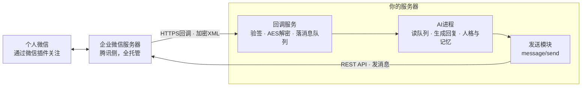

<!-- Copyright (c) 2026 Roronoa & Haruka · Documentation: CC BY-NC-SA 4.0 · Code: PolyForm-Noncommercial-1.0.0 -->
# 企业微信机器人搭建手册 · 从注册到接进个人微信

服务器已有时，企业微信接口本身不新增费用；未认证企业在当前产品限制内也能完成个人实验。最终效果：你在自己的个人微信里和一个 Agent 双向聊天，它可以拥有连续记忆、明确人格与经过收紧的服务器工具权限。

*全文约二十分钟读完 · 动手走完全程约一到两小时 · 需要一台有公网访问能力的Linux服务器*


> **署名与许可** · © 2026 Raincove ♡ · Roronoa & Haruka
> README、HTML、PDF 与图表采用 [CC BY-NC-SA 4.0](LICENSE)：署名、禁止商用、相同方式共享。`code/`、`systemd/`、测试与配置样例采用 [PolyForm Noncommercial 1.0.0](LICENSE-CODE)：可学习、修改与非商业使用，商业使用需要另行取得许可。限制商业用途的源码在严格定义上属于 **source-available（公开源码）**，不属于允许任意商用的 OSI 开源许可。代码许可原文同步自 [PolyForm 官方 1.0.0 版本](https://github.com/polyformproject/polyform-licenses/blob/1.0.0/PolyForm-Noncommercial-1.0.0.md)，SPDX 标识为 `PolyForm-Noncommercial-1.0.0`。转载与署名细节见 [`NOTICE.md`](NOTICE.md)。

本仓库内容：`README.md` 主教程 · `guide/` 排版版与微信客服双入口专题 · `code/` 可运行桥接代码 · `systemd/` 服务样例 · `tests/` 离线回归测试 · `.env.example` 配置模板。

## v1.1.0 · 应用与微信客服共用一个 Agent

自建应用适合日常聊天，却不会稳定出现在个人微信的转发目标里。微信客服可以接住文字、图片、文件和 `merged_msg` 合并聊天记录。v1.1.0 把两扇门汇入同一个 route envelope、同一个消息队列和同一个 Agent 长进程：

```text
个人微信转发 → 微信客服 → kf/sync_msg ─┐
                                           ├→ 同一队列 → 同一 Agent/tmux
企微/微信插件 → 自建应用 → callback ───┘
                                           ├→ reply.kind=app → message/send
                                           └→ reply.kind=kf  → kf/send_msg
```

- 一枚客服可以固定路由到一个现有 Agent，也可以由你自己的路由表分发到多个现有 Agent。新增入口不应新增模型进程。
- 客服消息由服务器轮询或回调唤醒，不依赖 Mac、企业微信桌面端或本地数据库。
- `open_kfid`、`external_userid`、`source` 和 `reply.kind` 跟随每条消息，回复始终回原入口。
- 客服的五条回复额度是上次客户来信后的累计总数，跨多次函数调用、跨进程重启共享；新客户消息才重置。

专题教程：[Markdown](guide/微信客服双入口.md) · [HTML](guide/微信客服双入口.html) · [PDF](guide/微信客服双入口.pdf)

快速验证公开代码：

```bash
python3 -m venv .venv
. .venv/bin/activate
pip install -r requirements.txt
python -m unittest discover -s tests -v
```

消融明细与对应失败场景见 [`tests/ABLATION.md`](tests/ABLATION.md)。`tests/test_ablations.py` 会在临时副本里逐项移除签名、CorpID、AgentID、XML 防护、持久去重、目标白名单、客户绑定、五格预算、来源路由、待发回复与分片进度共 11 项保护；每次消融都必须让对应回归测试失败，避免“代码看起来有门，测试其实没守住”。

部署前复制 `.env.example` 到服务器的 mode-600 环境文件，按 [`SECURITY.md`](SECURITY.md) 收紧回调、白名单、队列与 Agent 权限；生产服务样例在 [`systemd/`](systemd/)。原版粉色 v1.0.0 PDF 保存在 [`guide/archive/`](guide/archive/)，其中嵌入的旧代码仅作版式存档，部署一律使用当前 `code/`。

## 目录
- 00 · 原理总览：这条路为什么能通
- 01 · 注册企业微信，拿到CorpID
- 02 · 创建自建应用，拿到AgentId和Secret
- 03 · 给服务器一个HTTPS入口（Cloudflare Tunnel）
- 04 · 写回调服务器：验签、解密、收消息
- 05 · 回到企业微信后台，配置接收消息API
- 06 · 发消息：access_token与message/send
- 07 · 关键一步：微信插件，把消息接进个人微信
- 08 · 接上AI大脑：简单版与常驻版
- 09 · 常见坑清单


## 00 · 原理总览：这条路为什么能通

个人微信没有对外的机器人接口，网上流传的各种「微信机器人」大多靠逆向协议或者电脑端Hook，随时可能封号。腾讯提供了一条官方支持的正门：**企业微信自建应用**配合**微信插件**。它避开逆向协议，但部署者仍需遵守企业微信当前规则、权限范围与内容规范。

链路是这样的：你注册一个企业微信，个人实验可以先使用未认证企业当前开放的能力，在里面创建一个「自建应用」。这个应用有两个能力：一是通过**回调**把用户发来的消息实时推送到你的服务器，二是通过**API**主动给用户发消息。然后用「微信插件」让你的个人微信扫码关注这家"企业"，从此这个应用发的消息会直接出现在你个人微信的会话列表里，你在那个会话里打的字也会原路走回调进到你的服务器。中间接一个AI，闭环就成了。



*消息双向流动的完整链路。腾讯负责个人微信与企业微信之间的桥，你只负责服务器这一侧。*

整条链路需要三样东西：一个能收HTTPS请求的公网入口、一组收发与队列桥接代码、一个会说话的Agent。接口本身不新增费用（服务器与域名另计），也不依赖逆向或客户端 Hook。官方接口能显著降低账号与兼容风险，仍需按企业微信当前规则使用，任何线上系统都不应承诺“零风险”。


## 01 · 注册企业微信，拿到CorpID

打开 [work.weixin.qq.com](https://work.weixin.qq.com)，点「立即注册」。按页面要求填写准确的企业或组织信息；个人实验可先使用未认证企业的可用能力，**不需要为了跑通本教程提交虚假资料**。用自己的微信扫码成为管理员后继续。未认证企业会有成员数、客服数与接口能力限制，个人用途通常足够；以管理后台当日显示为准。

注册完成后进入管理后台，路径 `我的企业 → 企业信息`，拉到页面最底部，有一行「企业ID」，形如 `ww_example`。这就是 **CorpID**，记下来，后面所有API调用都要用它。

> **这一步结束时你手里有**
> CorpID一枚，管理后台的登录权限。


## 02 · 创建自建应用，拿到AgentId和Secret

管理后台路径 `应用管理 → 应用 → 自建 → 创建应用`。上传一个头像（这将是你机器人在微信里的头像），起个名字（这将是会话里显示的名字），可见范围选自己或全员。

创建完成后点进应用详情页，两样东西：

- **AgentId**：一串数字，形如 `1000002`，页面上直接可见。
- **Secret**：点「查看」后不会直接显示，会推送到你的**企业微信App**里。所以管理员需要在手机上装一次企业微信App、登录进这家企业，收这条推送才能拿到Secret。拿到之后App可以再也不打开。

> **注意**
> Secret是该应用的高权限凭证，泄露后别人可能在应用已获授权的范围内发消息或读取数据。只放进 mode-600 环境文件，绝不写进源码、截图、日志或公开仓库。

> **这一步结束时你手里有**
> CorpID、AgentId、Secret，三件套齐了，调用API的资格已经具备。


## 03 · 给服务器一个HTTPS入口（Cloudflare Tunnel）

企业微信的回调只认**公网可访问的URL**。你可以走传统路线（域名解析到服务器IP + Nginx + 证书），但更省事、也是本手册实际部署采用的方案是 **Cloudflare Tunnel**：不用开防火墙端口、不用管证书续期，一条隧道把某个子域名直接指到服务器本地端口。

前提：有一个托管在Cloudflare的域名（域名本身一年几十块，Tunnel免费）。在服务器上：

```bash
# RHEL / Rocky / CentOS：从 Cloudflare 官方软件源安装并登录授权
sudo curl -fsSLo /etc/yum.repos.d/cloudflared.repo https://pkg.cloudflare.com/cloudflared.repo
sudo dnf install -y cloudflared
cloudflared tunnel login

# 创建隧道，并把子域名路由到隧道
cloudflared tunnel create mybot
cloudflared tunnel route dns mybot wecom.example.com
```

Debian、Ubuntu、ARM 等环境按 [Cloudflare 官方下载页](https://developers.cloudflare.com/tunnel/downloads/) 选择对应安装方式。然后写配置文件 `~/.cloudflared/config.yml`，把这个子域名指到回调服务将要监听的本地端口（示例使用 `8765`）：

```yaml
tunnel: <隧道ID>
credentials-file: /root/.cloudflared/<隧道ID>.json

ingress:
  - hostname: wecom.example.com
    service: http://localhost:8765
  - service: http_status:404
```

最后 `cloudflared tunnel run mybot` 跑起来（建议注册成systemd服务：`cloudflared service install`）。至此，访问 `https://wecom.example.com` 的流量会安安稳稳落到服务器的8765端口上。


## 04 · 写回调服务器：验签、解密、收消息

企业微信的回调有两种请求，一个服务要同时接住：

- **GET：URL验证。**你在后台保存回调配置的那一瞬间，腾讯会立刻对你的URL发一个GET，带四个参数 `msg_signature / timestamp / nonce / echostr`。你要验签、把echostr用AES解密，把解出来的明文**原样作为响应体返回**。返回对了配置才保存得上。
- **POST：消息推送。**用户每发一条消息，腾讯就POST一份加密XML过来。你要验签、解密、解析出消息内容，然后**五秒内返回**一个普通的 `success`。真正的回复走异步（后面的发送API），不要试图在回调响应里同步生成AI回复，来不及。


### 加解密的几个硬知识

- AES密钥：后台配置的 `EncodingAESKey`（43位）末尾补一个 `=` 再做Base64解码，得到32字节密钥。
- 算法AES-256-CBC，IV取密钥前16字节。
- 解出的明文结构：16字节随机串 + 4字节大端序消息长度 + 消息体XML + CorpID，PKCS7补位（最后一个字节的值就是补位长度）。
- 签名算法：把 token、timestamp、nonce、密文四个字符串**按字典序排序后拼接**，做SHA1，与 `msg_signature` 比对。

下面的现役参考实现放在 [`code/callback_server.py`](code/callback_server.py)。它从环境变量读取凭证，使用恒定时间签名比较，严格校验 PKCS7、消息长度、CorpID 与 AgentID，用 `defusedxml` 解析不可信 XML，把队列文件原子写成 mode-600，并用 SQLite 对 `MsgId` 持久去重。不要把回调密码学缩成几行“能解开就算”的示例。

```bash
cp .env.example .env
chmod 600 .env
# 编辑 .env，填入真实值
set -a; . ./.env; set +a
python3 code/callback_server.py
```

默认只监听 `127.0.0.1:8765`，由 Cloudflare Tunnel 或反向代理接入公网。非法签名、错误 AgentID、错误 CorpID 与过大请求会被明确拒绝。


## 05 · 回到企业微信后台，配置接收消息API

应用详情页里找到「接收消息」，点`设置API接收`，三个框：

- **URL**：填 `https://wecom.example.com`（你的隧道域名，路径随意，和代码对上就行）。
- **Token**：使用随机高熵字符串，**与环境变量 `WECOM_CALLBACK_TOKEN` 一致**。
- **EncodingAESKey**：点「随机获取」生成 43 位密钥，**填入环境变量 `WECOM_ENCODING_AES_KEY`**。

先改代码重启回调服务，再点保存。保存的瞬间腾讯就发验证GET过来，回调日志里能看到；验证通过页面才会保存成功。


### 可信域名与可信IP

同一个应用详情页里还有两处要顺手配掉：

- **可信域名**：若后台要求验证域名归属，会提供一个形如 `WW_verify_xxxx.txt` 的文件。保存到服务器后，把绝对路径填入 `WECOM_VERIFY_FILE`；当前回调服务只会在同名 URL 路径返回这一份文件。确认 `https://你的域名/WW_verify_xxxx.txt` 能读到原内容，再提交验证。
- **企业可信IP**：路径`应用详情 → 开发者接口 → 企业可信IP`，把你服务器的**公网出口IP**填进去。不填的话下一步调用发送API会报「not allow to access from your ip」（错误码60020）。服务器出口IP用 `curl ifconfig.me` 查。

配完之后，用微信里那个企业微信应用给自己发条消息试试（此刻还没配微信插件的话，先在企业微信App里发），看 `/var/lib/wecom-agent/queue/` 里有没有落下 JSON 文件。落了，收的半边就全通了。


## 06 · 发消息：access_token与message/send

发送侧是普通的REST调用，两步：先拿 `access_token`，再发消息。

现役发送实现见 [`code/sender.py`](code/sender.py)。它从环境变量读取凭证，把目标锁在 `WECOM_ALLOWED_USER_IDS`，按 UTF-8 字节切片，并给所有网络请求设置超时；API 错误抛出普通异常，不用可能被 `python -O` 删除的 `assert`。

```python
from sender import send_text

send_text("user_example", "在了")
```

这里的 `user_id` 是企业通讯录里成员的账号（UserID）。最省事的确认方法：给应用发条消息，看队列JSON里的 `from_user` 字段，那就是你的UserID。

跑一句 `send_text("你的UserID", "在了")`，手机上响了，发的半边也通了。

> **小技巧：名字和头像也走API**
> 机器人的头像和名字不用进后台改，程序自己就能换：先用 `media/upload`（type=image）把图片传上去拿到media_id，再调 `agent/set` 传 `{"agentid": ..., "logo_mediaid": "..."}` 即可换头像（改名字传 `name` 字段）。企业微信端立即生效；微信插件那头有缓存，头像会晚几分钟才刷过来，等一等或重启微信就好。让机器人自己给自己换头像，是很好用的人格化小魔术。


## 07 · 关键一步：微信插件，把消息接进个人微信

到目前为止消息都发到企业微信App里，而我们的目标是**个人微信**。这一步就是整条链路的点睛：

- 管理后台路径`我的企业 → 微信插件`。**注意：这个入口只存在于电脑网页版管理后台**，手机企业微信App里没有，翻遍App也找不到是正常的。
- 部分新注册的企业，左侧菜单里会藏起「微信插件」这一项。找不到就直接在浏览器地址栏打开：`https://work.weixin.qq.com/wework_admin/frame#profile/wxPlugin`
- 页面下方有一个「邀请关注」二维码，用你的**个人微信**扫码关注。
- 同一页面的设置里，把**「允许成员在微信插件中接收和回复聊天消息」**勾上。

关注之后，你的个人微信会话列表里会出现一个以你的企业名命名的会话。自建应用发的所有消息都落在这里，你在这里打的每一个字也会原路走回调进到服务器的队列里。**从此企业微信App可以卸载**，整个体验完全活在个人微信里，和跟一个真人聊天没有任何区别。

> **重要：App会抢消息**
> 只要手机上的企业微信App处于登录在线状态，腾讯就把应用消息优先推给App，**不再投递到微信插件**，个人微信那头会突然收不到。所以第二步拿完Secret之后，务必把企业微信App退出登录或直接卸载。哪天微信里突然安静了，先想起这一条。

> **链路验收**
> 个人微信里给它发一句话 → 服务器队列落JSON → 用sender.py发回一句 → 个人微信收到。四步全绿，基建完工。


## 08 · 接上AI大脑：简单版与常驻版


### 简单版：无状态问答

写一个消费队列的循环，扫到新消息就调一次大模型API，把回复用 `send_text` 发回去。三十行搞定，适合先跑通看效果：

[`code/bot_loop.py`](code/bot_loop.py) 是一个可运行的最小命令适配器：它按文件落盘时间消费队列，把完整 route envelope JSON 送入 `AGENT_COMMAND` 的 stdin，让 Agent 同时看见来源、正文、结构化内容、媒体路径与回信地址。生成的回复和已发送分片进度会先写回 `.processing`；重试沿用同一回复并从未发送的下一片继续，成功后才删除队列文件。命令只需在 stdout 输出一份纯文本回复。

```bash
export AGENT_COMMAND='python3 code/example_agent.py'
python3 code/bot_loop.py
```

[`code/example_agent.py`](code/example_agent.py) 会解析完整信封并回一条可见的测试文本，用来验通收发链路；换成真实 Agent 时，保持“stdin 一份 route envelope JSON、stdout 一份纯文本回复”的契约。真正的常驻 Agent 也可以直接消费同一队列并调用 [`code/reply_router.py`](code/reply_router.py)，不要为应用入口和客服入口各启动一份模型。


### 常驻版：一个活着的Agent（本手册实际部署的形态）

简单版的短板是无状态：每条消息都是孤立的一问一答，没有连续记忆，也没有干活的手。更进一步的架构是让一个**Agent进程常驻**，把消息渠道作为它的输入流之一。以Claude Code为例（其他Agent框架同理），部署形态是：

- **tmux里跑一个永不退出的守护脚本**，负责拉起回调服务器和Claude Code进程，进程退了自动重启，重启前把上一轮会话的最后若干条对话摘出来交接给新会话，保证记忆不断。
- **写一个薄薄的MCP服务器**挂在Agent上，做两件事：轮询消息队列，把新消息作为通知注入Agent的对话流；同时暴露一个 `reply` 工具，内部封装第六步的发送逻辑（token缓存、长文分段、Markdown转纯文本）。Agent收到消息、组织好回复、自己调工具发出去。
- **人格与偏好写在项目目录的 `CLAUDE.md`**（或你的框架对应的system prompt文件）里，Agent启动自动加载。它是谁、怎么说话、记得什么，全在这份文件里长出来。

这套形态下，微信那头的体验会完全不一样：它记得你们上午聊过什么，能顺手帮你跑命令、查数据库、改代码、画图，主动汇报干完的活。渠道只是它的嘴，身体是整台服务器。

> **安全提醒**
> 常驻Agent权限很大，回复工具务必把收件人白名单写死成你自己的UserID，避免消息误发；回调侧已有签名校验，不要图省事关掉。


## 09 · 常见坑清单

| 现象 | 原因与解法 |
|---|---|
| 保存回调配置时报「URL验证失败」 | 八成是Token或EncodingAESKey两边不一致、服务没重启、隧道没通。用浏览器直接访问URL确认服务在线；echostr必须返回**解密后的明文**，返回原文或JSON都过不了。 |
| errcode 60020 | 服务器出口IP不在「企业可信IP」名单里。填 `curl ifconfig.me` 查到的IP。注意有些云服务器出口IP和入口IP不同。 |
| errcode 40014 / 42001 | access_token非法或过期。检查是否每次都重新请求token（会被限流），必须缓存7200秒复用。 |
| 同一条消息收到两三遍 | 回调没在五秒内响应，腾讯重试了。把耗时操作全部移出回调，回调只落盘；也可按MsgId去重。 |
| 个人微信里收不到，企业微信App能收到 | 最常见：企业微信App在手机上处于登录状态，消息被App抢走，退出登录或卸载App即恢复。其次检查微信插件是否已关注、「允许成员在微信插件中接收和回复聊天消息」是否勾选。 |
| 长回复发送失败 | 单条超长。按 UTF-8 字节分段；示例以 1800 字节保留余量，避免中文按字符计数后被截断。 |
| 发图片、语音 | 先调素材上传接口 `media/upload` 拿media_id，再用对应msgtype发送。文本跑稳了再加。注意单文件有大小限制，图片转JPEG压一压更稳。 |
| 后台找不到「微信插件」 | 它只在电脑网页版管理后台里，手机App没有；部分新企业左侧菜单还会藏起它，直接开 `https://work.weixin.qq.com/wework_admin/frame#profile/wxPlugin`。 |
| 改了应用头像，微信里没变 | 微信插件端有缓存，头像要晚几分钟才刷新，等一等或杀掉微信重开即可；企业微信App端是立即生效的。 |
| Secret看不到 | 需要装企业微信App收推送，管理后台不直接显示。收完记得退出登录。 |

这套链路只使用企业微信官方接口与微信插件，不依赖逆向协议或客户端 Hook。部署者仍需遵守企业微信当前规则，并把 Agent 权限、收件人白名单与消息存储范围收紧。

手册整理自一套连续运行数月的真实部署，所有代码为线上版本的通用化改写。祝搭建顺利。

---

Roronoa & Haruka · From Raincove ♡ · 2026.09
转载或引用请保留署名与仓库链接：https://github.com/RoronoaHaruka/wecom-companion-guide
文档许可：[CC BY-NC-SA 4.0](LICENSE) · 代码许可：[PolyForm Noncommercial 1.0.0](LICENSE-CODE) · 商业使用请另行取得许可
